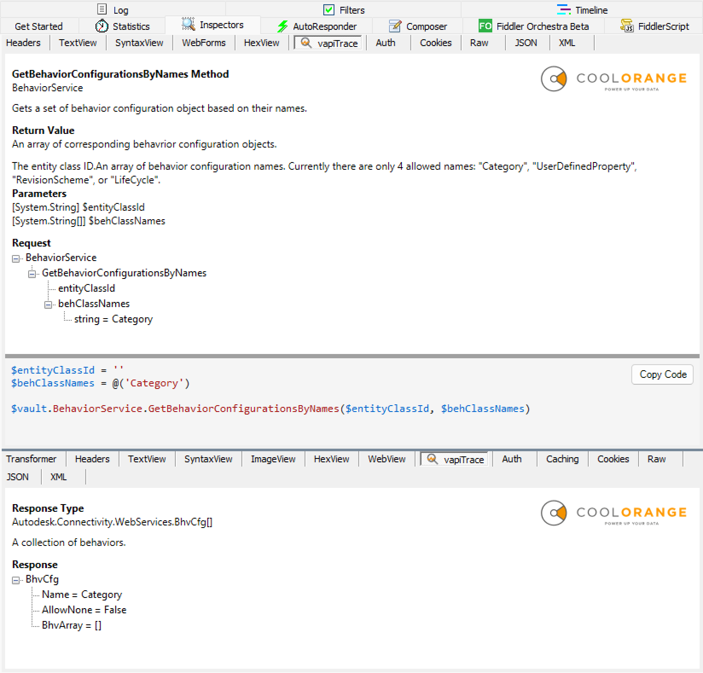
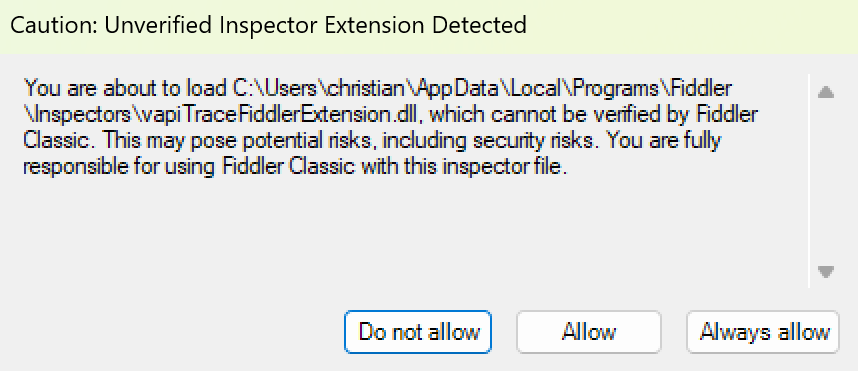

# vapiTrace

[](https://www.microsoft.com/windows/)
[](https://dotnet.microsoft.com/)
[](https://www.telerik.com/fiddler/fiddler-classic)
[](https://www.autodesk.com/products/vault/overview)

Learn the Autodesk Vault API by watching how the Vault client talks to the server. `vapiTrace` adds a custom inspector to `Fiddler Classic` and turns captured Vault SOAP traffic into a more readable request and response view.



## What It Shows

- The Vault service and method name for each SOAP request
- The request payload as a readable tree
- A corresponding PowerShell code snippet for the selected request
- The response type and response payload as a readable tree
- Vault XML documentation when the local Vault assemblies provide it

## Compatibility

- Windows only
- .NET Framework 4.8
- Fiddler Classic v5.0 or newer
- Autodesk Vault client components installed locally

`vapiTrace` is built for **Fiddler Classic**, not Fiddler Everywhere.

## Prerequisites

Before using the extension, make sure the following are installed on the same machine:

- Fiddler Classic
- Autodesk Vault client or another Vault installation that provides `Autodesk.Connectivity.WebServices.dll`
- The matching Vault XML documentation file if you want method and type documentation inside the inspector

## Installation

1. Download the ZIP from the repository's Releases page.
2. Extract the extension into the Fiddler Classic Inspectors folder:

```text
%localappdata%\Programs\Fiddler\Inspectors
```

3. Start or restart Fiddler Classic.
4. Select "Always allow" in case a warning dialog appears:

   
5. Capture Vault traffic and open the `vapiTrace` inspector tab.

## Usage

1. Start Fiddler Classic.
2. If your Vault traffic is HTTPS, enable HTTPS decryption in Fiddler Classic.
3. Run the Vault client action you want to inspect.
4. Select a captured Vault request in Fiddler Classic.
5. Open the `vapiTrace` tab to inspect the request and response.

## Building From Source

The project currently targets `.NET Framework 4.8` and references the locally installed Fiddler Classic executable.

### Requirements

- Visual Studio with .NET Framework 4.8 targeting pack
- Fiddler Classic installed
- Autodesk Vault client components installed if you want to test the full experience locally

### Notes

- The project file references `Fiddler.exe` from the local Fiddler Classic installation folder.
- The Debug build is configured to copy the compiled extension directly into the local Fiddler Inspectors folder.

## Troubleshooting

### The `vapiTrace` tab does not appear

- Verify that the DLL was copied to the Fiddler Classic `Inspectors` folder.
- Restart Fiddler Classic after copying the extension.
- Confirm you are using Fiddler Classic, not Fiddler Everywhere.

### The inspector shows no documentation

- `vapiTrace` can still work without XML docs, but method and type documentation will be missing.
- Install a Vault version that includes both `Autodesk.Connectivity.WebServices.dll` and its XML documentation file.

### The inspector cannot resolve Vault types

- Make sure a local Autodesk Vault installation is present.
- The extension searches common Autodesk installation folders for `Autodesk.Connectivity.WebServices.dll`.

## Disclaimer

THE SAMPLE CODE IN THIS REPOSITORY IS PROVIDED "AS IS" WITHOUT WARRANTY OF ANY KIND, EXPRESS OR IMPLIED, INCLUDING BUT NOT LIMITED TO THE WARRANTIES OF MERCHANTABILITY, FITNESS FOR A PARTICULAR PURPOSE, AND NON-INFRINGEMENT.

USE THIS SAMPLE AT YOUR OWN RISK. THERE IS NO SUPPORT PROVIDED FOR IT.
